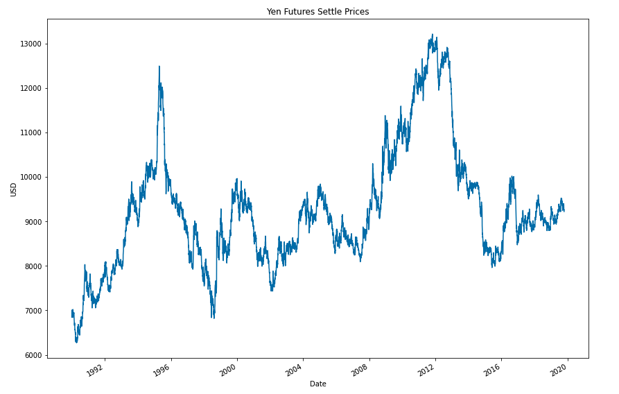
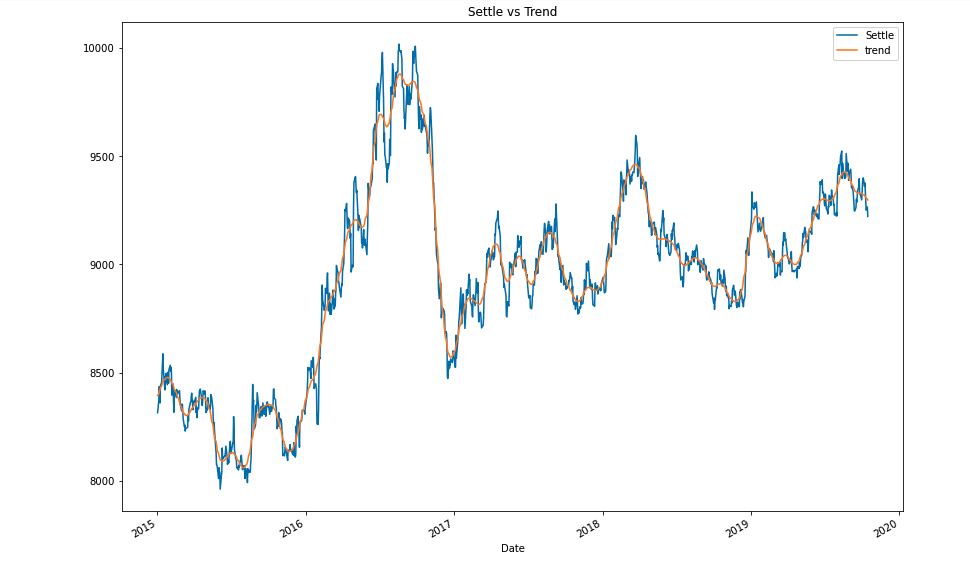
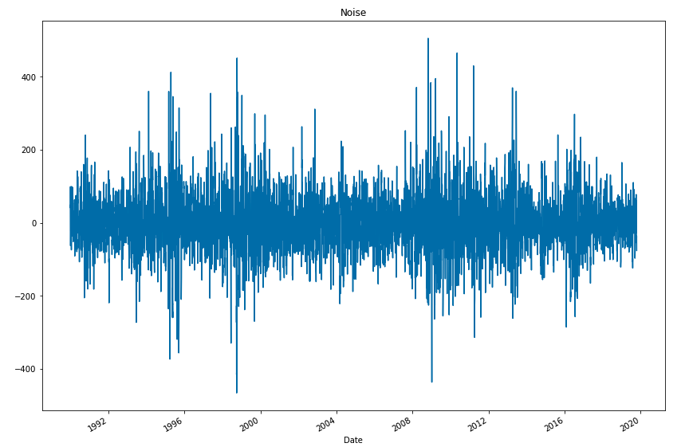
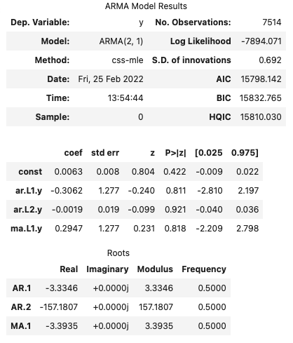
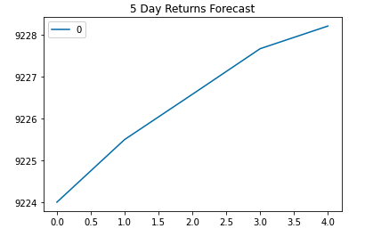
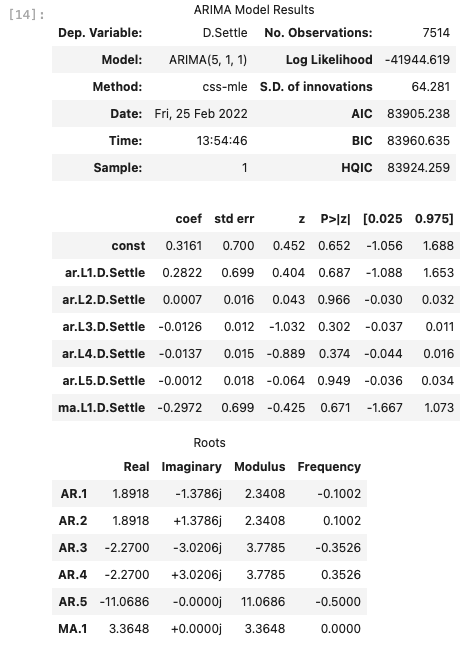
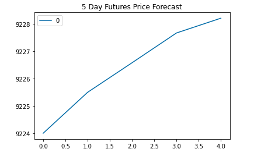
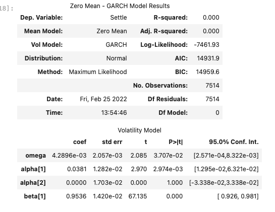
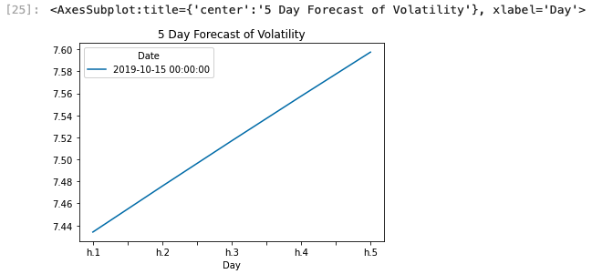
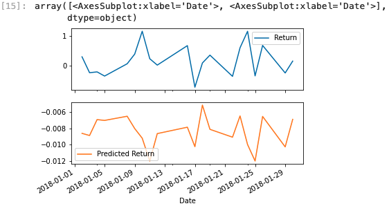

# Yen Future Valuation

## Goal  
Use time-series analysis (ARMA, ARIMA, and GARCH models), and regression analysis (linear using SKlearn) to predict movements for Futures contract on the Yen-dollar exchange rate.

------------------------------------------------------------------------------------------

# Time Series Analysis

### Historical Settle Prices 

### Decomposition Using a Hodrick-Prescott Filter

### ARMA model results and 5-day forecast of Future Returns

### ARIMA model results and 5-day forecast of Future Settle Prices

### GARCH model results and 5-day forecast of Future Price Volatility

### Based on time series analysis, should we buy the yen now? 

The ARIMA model results forecast an increase in Yen future settle price over the next 5 days, and the ARMA model suggests the same for Yen future returns.

### Is the risk of the yen expected to increase or decrease?

It should be noted that the 5 day volatility forecast from our GARCH model suggests a daily increase in Yen future volatility. As a result, we should expect Yen future risk to increase.   

### Based on the model evaluation, would you feel confident in using these models for trading?

P-values are both significantly greater than .05 for ARMA and ARIMA. Therefore, I would NOT feel confident using these instances of ARMA or ARIMA to trade. However, we may be confident in our volatilty forecast since GARCH model p-val is 3.707e-02 (nearly .003).

-------------------------------------------------------------------------------------------

# Linear Regression Analysis

### Predictions with Test Data

### Evaluate the model using "out-of-sample" data (X_test and y_test)

Out-of-Sample Root Mean Squared Error (RMSE): 0.4154832784856737

### Evaluate the model using in-sample data (X_train and y_train)

In-sample Root Mean Squared Error (RMSE): 0.5963660785073426

### Does this model perform better or worse on out-of-sample data compared to in-sample data?

The regression model has a smaller root mean squared error with out-of-sample data. Less error mean more accuracy, so it appears the model performs better with out-of-sample than in-sample data. 